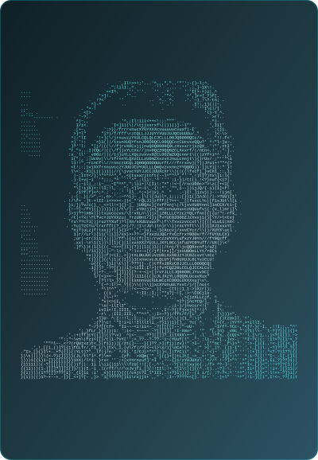
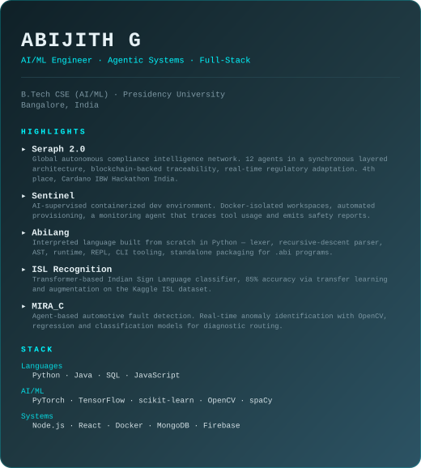
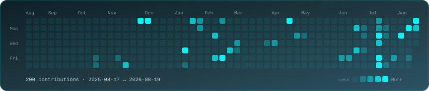

<table>
<tr>
<td valign="top"></td>
<td valign="top"></td>
</tr>
</table>

 

### Abijith G

**AI/ML Engineer · Agentic Systems · Full-Stack**

 

---

### Seraph 2.0 — autonomous compliance intelligence

A global compliance intelligence network built on a **12-agent architecture**
running as a synchronous layered system. Blockchain-backed for trust,
traceability, and decentralization, targeting real-time regulatory intelligence
and adaptive compliance.

**4th Place — Cardano IBW Hackathon India**

### Sentinel — AI-supervised dev environments

A Docker-isolated workspace for safe, reproducible experimentation. Handles
automated provisioning and container lifecycle management, with a monitoring
agent that observes developer actions, tool usage, and system requests, then
emits activity reports, execution traces, and safety insights for AI-assisted
development.

### AbiLang — an interpreted language from scratch

A complete language pipeline written in Python: lexical analysis,
recursive-descent parsing, AST generation, and runtime interpretation.
Supports functions, recursion, conditionals, loops, custom error handling, and
an interactive REPL — plus CLI tooling, automated tests, and standalone
executable packaging for `.abi` programs.

### Transformer-Based Indian Sign Language Recognition

A deep learning research project in computer vision. Transformer-based image
classification trained on the Kaggle ISL dataset, reaching **85% accuracy**
through transfer learning, augmentation, and optimization, with experimentation
and benchmarking documented in PyTorch.

### MIRA_C — agent-based automotive fault detection

Identifies vehicle anomalies in real time via computer vision. OpenCV handles
visual fault identification; regression and classification models drive
diagnostic routing.

---

Cards are generated and committed by GitHub Actions — see <code>scripts/</code>.
